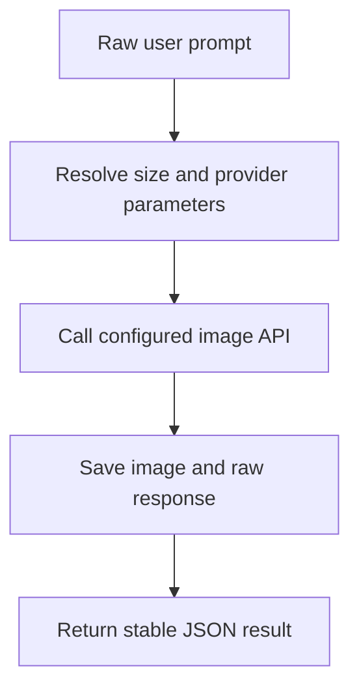

# AI Image Generator

[中文](./README.md) | English

A reusable AI image generation component for Codex, Claude Code, OpenClaw, and other agent skill authors. It turns scattered "generate an image" requests into one stable entry point: prefer the agent's native image generation capability, or pass the user's prompt unchanged to configured API providers when needed, while resolving common platform sizes, accepting reference images, saving outputs, and returning a stable JSON result.

It can be used directly by users, or called by other skills as the shared image generation layer. Upstream skills no longer need to re-implement Nano Banana, GPT-image2, SiliconFlow, or OpenAI-compatible image APIs, and they do not need to duplicate common size rules for WeChat covers, Xiaohongshu cards, PPT covers, mobile wallpapers, and similar assets.

## Install

```bash
git clone https://github.com/chemny/ai-image-generator.git
```

Place the cloned folder in the skills directory used by your agent, or import it using your agent's own skill installation flow. Keep `SKILL.md` at the root of that skill folder.

Common examples:

```text
~/.agents/skills/ai-image-generator
~/.codex/skills/ai-image-generator
~/.claude/skills/ai-image-generator
```

After installing, start a fresh agent session so it can rescan skills.

## Quick Start

Ask your agent:

```text
Use ai-image-generator to generate a WeChat Official Account main cover about AI image model configuration.
```

Or run the CLI directly:

```bash
bash scripts/generate-image.sh \
  --provider auto \
  --prompt "Generate a WeChat Official Account main cover about AI image model configuration" \
  --output-dir ./outputs
```

If the user does not explicitly specify dimensions, the script checks the platform specs table. In this example, "WeChat Official Account main cover" resolves to `wechat_main_cover`, default size `1800x766`, visual ratio `2.35:1`, and provider-side ratio `21:9`.

## Core Workflows

### 1. Direct Image Generation

Use this when the user already knows what they want and only needs the prompt sent to the image model.



Default rules:

- Direct mode is the default.
- The prompt is sent to the model unchanged.
- The skill does not rewrite, expand, optimize, translate, or imitate prompts.
- When the current agent/runtime provides native image generation, use it first by default.
- When using the script or API fallback, `auto` order is `gpt-image2 -> nano-banana -> siliconflow-qwen-image -> openai`.
- Size resolution only fills API parameters. It does not modify prompt text.

### 2. Component Call From Other Skills

Use this for content factories, slide tools, WeChat article workflows, Xiaohongshu workflows, marketing posters, article illustrations, and other skills that need image generation.

```bash
bash /path/to/ai-image-generator/scripts/generate-image.sh \
  --provider auto \
  --prompt "$USER_PROMPT" \
  --output-dir "$OUTPUT_DIR" \
  --output-prefix "$ASSET_ID"
```

The calling skill only needs to provide the business prompt and output directory. It should read `images[]` from the returned JSON and should not guess output paths.

### 3. Size Resolution Only

Use this when another skill wants to inspect size rules before calling an image API.

```bash
bash scripts/resolve-image-spec.sh \
  --query "Generate a Xiaohongshu card about AI tools"
```

Example result:

```json
{
  "source": "matched_spec",
  "asset_type": "xhs_content_card",
  "size": "1080x1440",
  "aspect_ratio": "3:4",
  "provider_aspect_ratio": "3:4"
}
```

## Core Capabilities

- Direct mode: send the user's prompt to the model unchanged.
- Pro mode: check only for missing basic prompt information; no creative rewriting.
- Provider priority: agent-native image generation first; script/API `auto` then tries `gpt-image2 -> nano-banana -> siliconflow-qwen-image -> openai`.
- Reference images: supports image-to-image or edit-style generation.
- Size resolver: chooses parameters from explicit user size, platform keywords, or provider defaults.
- Stable JSON output: image paths, provider, raw response path, and size source.
- Integration contract: other skills can call it using [integration-contract.md](./references/integration-contract.md).

## Requirements

- `bash`
- `curl`
- `jq`
- `base64`

On macOS:

```bash
brew install jq
```

Each user must configure their own API URL and key. Supported env locations:

```text
~/.config/ai-image-generator/.env
~/.ai-image-generator/.env
./.env
```

Start from the example file:

```bash
cp .env.example .env
```

## Configuration Examples

Default script/API provider order:

```bash
IMAGE_PROVIDER="auto"
```

Agent-level default order:

```text
agent-native image generation
> script/API auto
> user-pinned provider
```

GPT-image2-compatible API:

```bash
GPT_IMAGE2_BASE_URL="https://your-provider.example"
GPT_IMAGE2_MODEL="gpt-image-2-all"
GPT_IMAGE2_API_KEY="your_api_key_here"
```

Nano Banana-compatible API:

```bash
NANO_BANANA_API_URL="https://your-provider.example/v1beta/models/your-model:generateContent"
NANO_BANANA_API_KEY="your_api_key_here"
```

SiliconFlow Qwen Image:

```bash
SILICONFLOW_BASE_URL="https://api.siliconflow.cn/v1/images/generations"
SILICONFLOW_MODEL="Qwen/Qwen-Image"
SILICONFLOW_API_KEY="your_api_key_here"
```

OpenAI GPT Image-compatible API:

```bash
OPENAI_IMAGE_API_KEY="your_openai_or_proxy_key_here"
OPENAI_IMAGE_MODEL="gpt-image-1.5"
OPENAI_IMAGE_GENERATE_URL="https://api.openai.com/v1/images/generations"
OPENAI_IMAGE_EDIT_URL="https://api.openai.com/v1/images/edits"
```

## Important Rules

- Do not commit real `.env` files, API keys, provider keys, cookies, or private API URLs.
- Direct mode does not rewrite prompts.
- When the current agent provides native image generation and the user did not request a third-party provider, use the agent-native capability first.
- `scripts/generate-image.sh` cannot call agent-native tools directly; it only handles API provider fallback.
- Explicit user-provided size always wins.
- If the user does not specify size, match known platform/use-case keywords.
- If no spec matches, do not invent a size. Let the provider or script default apply.
- For text-heavy images that require exact Chinese layout, upstream skills should use deterministic rendering. This skill should generate raw images or backgrounds.

## Command Reference

### Check Configuration

```bash
bash scripts/check-config.sh
```

### Generate Image

```bash
bash scripts/generate-image.sh \
  --provider auto \
  --prompt "Generate a mobile wallpaper about a sunrise city skyline" \
  --output-dir ./outputs
```

### Generate With Reference Image

```bash
bash scripts/generate-image.sh \
  --provider auto \
  --input-image /absolute/path/reference.png \
  --prompt "Use this product photo to create a clean e-commerce main image" \
  --output-dir ./outputs
```

### Resolve Image Spec

```bash
bash scripts/resolve-image-spec.sh \
  --query "Create a PPT cover about AI workflows"
```

### Pro Prompt Check

```bash
bash scripts/build-prompt-brief.sh \
  --query "Make a poster for a summer coffee campaign"
```

## Image Size Rules

Size resolution priority:

```text
explicit user size/aspect ratio
> explicit size/aspect ratio in the prompt
> matched platform/use-case spec
> provider/script default
```

Common specs:

- WeChat main cover: `2.35:1`, `1800x766`; use `21:9` when the provider cannot render exact `2.35:1`.
- WeChat body image: `16:9`, `1920x1080`.
- Xiaohongshu cover/content card: `3:4`, `1080x1440`.
- Douyin cover: `9:16`, `1080x1920`.
- PPT cover: `16:9`, `1920x1080`.
- Mobile wallpaper: `9:16`, `1080x1920`.
- E-commerce main image and avatar: `1:1`.

The machine-readable spec table is [platform-image-specs.json](./references/platform-image-specs.json).

## Output

Successful calls return JSON:

```json
{
  "status": "success",
  "provider": "gpt-image2",
  "images": ["/absolute/path/generated.png"],
  "raw_json": "/absolute/path/response.json",
  "image_spec": {
    "source": "matched_spec",
    "asset_type": "wechat_main_cover",
    "size": "1800x766",
    "aspect_ratio": "2.35:1",
    "provider_aspect_ratio": "21:9"
  }
}
```

Calling skills should treat `images[]` as the only generated image path contract.

## Platform Compatibility

Designed to be portable across Codex, Claude Code, and OpenClaw. Current status:

```text
Codex: tested by local script checks
Claude Code: not tested in this environment
OpenClaw: not tested in this environment
```

## Repository Structure

```text
ai-image-generator/
├── SKILL.md
├── README.md
├── README.en.md
├── LICENSE
├── .env.example
├── references/
│   ├── integration-contract.md
│   ├── platform-image-specs.md
│   └── platform-image-specs.json
├── scripts/
│   ├── build-prompt-brief.sh
│   ├── check-config.sh
│   ├── generate-image.sh
│   └── resolve-image-spec.sh
├── ACCEPTANCE.md
├── CHANGELOG.md
└── RELEASE_CHECKLIST.md
```

## Safety

`.env`, local outputs, old prompt data, evals, response JSON files, workflow test results, and local publish-check reports are excluded by `.gitignore`. The public repository keeps only example configuration, scripts, specs, and documentation.

Before publishing a fork or derived release, run a sensitive-data scan and confirm that no real API key, private URL, local path, or generated response is committed.

## License

MIT. See [LICENSE](./LICENSE).
