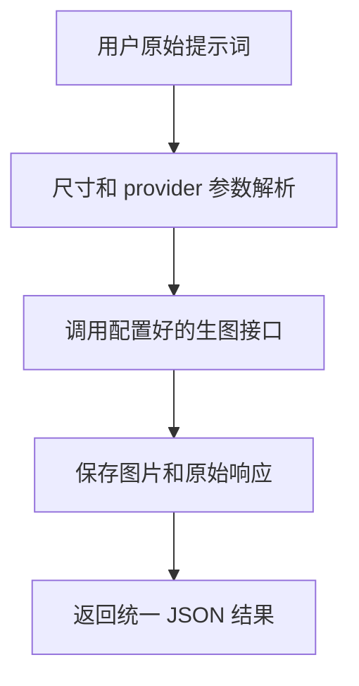

# AI Image Generator

中文 | [English](./README.en.md)

面向 Codex、Claude Code、OpenClaw 和其他 Agent skill 作者的通用 AI 生图组件。它把“用户想要生成图片”这类分散需求收敛成一个可复用的调用入口：原样传递用户提示词，统一处理多 provider 配置、图片尺寸推断、参考图输入、生成结果保存和 JSON 输出。

它适合被独立使用，也适合被其他 skills 当作底层生图能力调用。其他 skill 不需要再各自实现 Nano Banana、GPT-image2、SiliconFlow 或 OpenAI 兼容接口，也不需要重复维护微信公众号头图、小红书配图、PPT 封面、手机壁纸等常见图片尺寸。

## 怎么安装？

```bash
git clone https://github.com/chemny/ai-image-generator.git
```

把克隆后的目录放到你的 Agent 会扫描的 skills 目录里，或按你的 Agent 的安装方式导入。确保 `SKILL.md` 位于该 skill 目录根部。

常见位置示例：

```text
~/.agents/skills/ai-image-generator
~/.codex/skills/ai-image-generator
~/.claude/skills/ai-image-generator
```

安装后开一个新的 Agent 会话，让它重新扫描 skills。

## 快速开始

对 Agent 说：

```text
使用 ai-image-generator 生成一张微信公众号头图，主题是 AI 生图模型配置。
```

也可以直接运行 CLI：

```bash
bash scripts/generate-image.sh \
  --provider auto \
  --prompt "生成一张微信公众号头图，主题是 AI 生图模型配置" \
  --output-dir ./outputs
```

如果用户没有显式指定尺寸，脚本会先检查常见平台规格表。上面的“微信公众号头图”会匹配到 `wechat_main_cover`，默认尺寸 `1800x766`，视觉比例 `2.35:1`，provider 侧使用更通用的 `21:9`。

## 核心流程

### 1. 直接生图

适合用户已经知道自己想生成什么，只需要把提示词交给模型出图。



默认规则：

- Direct 模式默认开启。
- 提示词原样传给模型。
- 不自动改写、扩写、优化、翻译或仿写 prompt。
- 尺寸解析只补 API 参数，不改变提示词内容。

### 2. 给其他 skills 调用

适合内容工厂、PPT、公众号、小红书、营销海报、文章配图等 skills 需要统一生成图片。

```bash
bash /path/to/ai-image-generator/scripts/generate-image.sh \
  --provider auto \
  --prompt "$USER_PROMPT" \
  --output-dir "$OUTPUT_DIR" \
  --output-prefix "$ASSET_ID"
```

调用方只需要处理业务意图和输出目录，不需要关心 provider 的 API 差异。生成成功后读取 `images[]` 即可，不要猜测输出文件路径。

### 3. 只解析图片规格

适合其他 skills 在调用生图前先确认尺寸来源。

```bash
bash scripts/resolve-image-spec.sh \
  --query "生成一张小红书配图，主题是 AI 工具"
```

返回示例：

```json
{
  "source": "matched_spec",
  "asset_type": "xhs_content_card",
  "size": "1080x1440",
  "aspect_ratio": "3:4",
  "provider_aspect_ratio": "3:4"
}
```

## 核心能力

- Direct 模式：用户说什么，就把什么交给模型。
- Pro 模式：只检查提示词基础信息是否缺失，不做创意改写。
- 多 provider：支持 `auto`、`gpt-image2`、`nano-banana`、`siliconflow-qwen-image`、`openai`。
- 参考图输入：支持 image-to-image 或编辑类生成。
- 尺寸解析：根据显式尺寸、平台关键词或 provider 默认值决定参数。
- 统一输出：返回稳定 JSON，包含图片路径、provider、原始响应和尺寸来源。
- 可复用契约：其他 skills 可按 [integration-contract.md](./references/integration-contract.md) 调用。

## 运行要求

- `bash`
- `curl`
- `jq`
- `base64`

macOS 可安装 `jq`：

```bash
brew install jq
```

每个用户需要配置自己的 API 地址和 key。可以使用以下任一位置：

```text
~/.config/ai-image-generator/.env
~/.ai-image-generator/.env
./.env
```

可以从示例文件开始：

```bash
cp .env.example .env
```

## 配置示例

默认 provider 顺序：

```bash
IMAGE_PROVIDER="auto"
```

GPT-image2 兼容接口：

```bash
GPT_IMAGE2_BASE_URL="https://your-provider.example"
GPT_IMAGE2_MODEL="gpt-image-2-all"
GPT_IMAGE2_API_KEY="your_api_key_here"
```

Nano Banana 兼容接口：

```bash
NANO_BANANA_API_URL="https://your-provider.example/v1beta/models/your-model:generateContent"
NANO_BANANA_API_KEY="your_api_key_here"
```

SiliconFlow Qwen Image：

```bash
SILICONFLOW_BASE_URL="https://api.siliconflow.cn/v1/images/generations"
SILICONFLOW_MODEL="Qwen/Qwen-Image"
SILICONFLOW_API_KEY="your_api_key_here"
```

OpenAI GPT Image 兼容接口：

```bash
OPENAI_IMAGE_API_KEY="your_openai_or_proxy_key_here"
OPENAI_IMAGE_MODEL="gpt-image-1.5"
OPENAI_IMAGE_GENERATE_URL="https://api.openai.com/v1/images/generations"
OPENAI_IMAGE_EDIT_URL="https://api.openai.com/v1/images/edits"
```

## 重要规则

- 不要把真实 `.env`、API key、provider key、cookie 或私有接口地址提交到仓库。
- Direct 模式不改写 prompt。
- 用户显式指定尺寸时，永远优先使用用户指定值。
- 用户没有指定尺寸时，才按平台关键词查规格表。
- 规格表匹配不到时，不强行猜测尺寸，交给 provider 或脚本默认值。
- 对于文字非常多、需要精确中文排版的图片，建议由上游 skill 使用确定性渲染；本 skill 负责原始图片或背景图生成。

## 命令参考

### 检查配置

```bash
bash scripts/check-config.sh
```

### 生成图片

```bash
bash scripts/generate-image.sh \
  --provider auto \
  --prompt "生成一张手机壁纸，主题是清晨城市天际线" \
  --output-dir ./outputs
```

### 带参考图生成

```bash
bash scripts/generate-image.sh \
  --provider auto \
  --input-image /absolute/path/reference.png \
  --prompt "基于这张产品图生成一张干净的电商主图" \
  --output-dir ./outputs
```

### 解析图片规格

```bash
bash scripts/resolve-image-spec.sh \
  --query "做一张 PPT 封面，主题是 AI 工作流"
```

### Pro 缺项检查

```bash
bash scripts/build-prompt-brief.sh \
  --query "给夏季咖啡活动做一张海报"
```

## 图片尺寸规则

尺寸解析优先级：

```text
用户显式指定尺寸/比例
> 提示词里出现的明确尺寸/比例
> 匹配平台或用途规格表
> provider 或脚本默认值
```

常见规格：

- 微信公众号头图：`2.35:1`，`1800x766`；provider 不支持时用 `21:9`。
- 微信公众号正文配图：`16:9`，`1920x1080`。
- 小红书封面/配图：`3:4`，`1080x1440`。
- 抖音封面：`9:16`，`1080x1920`。
- PPT 封面：`16:9`，`1920x1080`。
- 手机壁纸：`9:16`，`1080x1920`。
- 电商主图和头像：`1:1`。

机器可读规格表见 [platform-image-specs.json](./references/platform-image-specs.json)。

## 输出结果

成功时返回 JSON：

```json
{
  "status": "success",
  "provider": "gpt-image2",
  "images": ["/absolute/path/generated.png"],
  "raw_json": "/absolute/path/response.json",
  "image_spec": {
    "source": "matched_spec",
    "asset_type": "wechat_main_cover",
    "size": "1800x766",
    "aspect_ratio": "2.35:1",
    "provider_aspect_ratio": "21:9"
  }
}
```

调用方应以 `images[]` 作为生成图片路径的唯一契约。

## 平台兼容性

设计上尽量兼容 Codex、Claude Code 和 OpenClaw。当前状态：

```text
Codex: 已做本地脚本检查
Claude Code: 当前环境未测试
OpenClaw: 当前环境未测试
```

## 仓库结构

```text
ai-image-generator/
├── SKILL.md
├── README.md
├── README.en.md
├── LICENSE
├── .env.example
├── references/
│   ├── integration-contract.md
│   ├── platform-image-specs.md
│   └── platform-image-specs.json
├── scripts/
│   ├── build-prompt-brief.sh
│   ├── check-config.sh
│   ├── generate-image.sh
│   └── resolve-image-spec.sh
├── ACCEPTANCE.md
├── CHANGELOG.md
└── RELEASE_CHECKLIST.md
```

## 安全说明

`.env`、本地输出、旧 prompt 数据、evals、响应 JSON、测试结果和本地发布检查报告都通过 `.gitignore` 排除。公开仓库只保留示例配置、脚本、规格表和文档。

如果你要公开 fork 或二次发布，请先运行敏感信息扫描，确认没有真实 API key、私有 URL、本地路径或生成响应被提交。

## License

MIT。见 [LICENSE](./LICENSE)。
